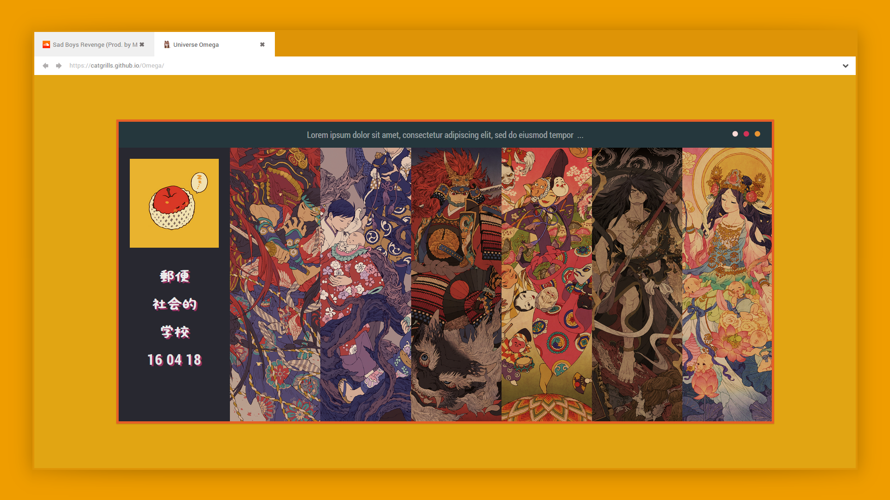

# Omega



[Live Demo](https://catgrills.github.io/Omega/) of <i>Omega</i>.

About
-------------------------------

<i>Omega</i> is a startpage featuring three different themes.

Startpages are locally hosted, usually, webpage that serves as a homepage for your browser.

Instruction
-------------------------------

<strong>Step 1 : Right click on the <i>.htm</i> file and open it with a browser of your choice</strong>

<strong>Step 2 : Set the startpage as the homepage </strong>

<ol> 
<li> create a github account and fork this repository.</li>
<li> download <a href="https://desktop.github.com/">Github Desktop</a>, go to File/Options and Sign in with your current account.</li>
<li> go to File/Clone repository and select the one you forked (it'll be named <i>Username/Omega</i>). </li>
<li> click the <i>Current branch</i> tab and select <i>gh-pages</i>. Then go to Repository/Show in Explorer to customize the startpage. After modifying what you want, return to Github Desktop window and click the button <i>Commit to gh-pages</i> (you'll have to write a title in Summary before).</li>
<li> finally, click the button <i>Push origin</i>. After 10 minutes or less, you'll be able to go to https://username.github.io/Omega/.</li>
<li> go to your browser setting and set https://username.github.io/Omega/ as your default homepage.</li>
<li> download the add-on <i>New Tab Override</i> (<a href="https://chrome.google.com/webstore/detail/new-tab-override/fjcmlondipcnnpmbcollgifldmajfonf?hl=en-GB">Google Chrome</a> or <a href="https://addons.mozilla.org/en-US/firefox/addon/new-tab-override/">Firefox Mozilla</a>), go to options and select <i>current home page</i></li>
</ol>

<strong>Step 3 : Install the font </strong>

I use several fonts for the startpage.
<ol>
<li> <a href="https://www.freejapanesefont.com/kf-himaji/">KFhimaji</a></li>
<li> <a href="https://www.fontsquirrel.com/fonts/roboto">Roboto</a></li>
</ol>

Features
-------------------------------

<span><i>Omega</i> has two main features.</span>
<ol>
<li>You can set 3 (or more) themes with different avatar and backgrounds. To switch between theme, you have to click one of the three circles in the header : the first theme corresponds to the first square on the left, the second the one in the middle, and the third the square on the right.</li>
<li>In the search bar, by entering some special keys, such as <i>-y jazz music</i>, you'll be able to search directly on youtube and not on Google. Another exemple with `-w moe`, it'll search 'moe' on wikipedia.</li>
</ol>

Customizing
-------------------------------

### Themes
- if you want to edit the themes available, first of all open the `background` folder, go to one of the first three subfolders and replace the six backgrounds by the ones you want (be sure to rename them correctly, ie `background01.png`, ..., `background06.png`).
- open the `avatar` folder and replace the avatar of the theme you edit with the one you want : if you edited the second theme, you'll have to rename your avatar `avatar_theme02.png`.
- you'll notice that when you hover one of the background in this startpage, there'll be a transparent color div. You'll have to enter the color code for each background you used. To do that, open one of the `theme.css` file in a text editor and edit the value of `background` for every `#picture[number between 1 and 6]:before`. For example, if I want to have a black div when hovering the first background, I will have the following code : 

``` javascript
#picture1:before {
	background: rgba(0,0,0,.5);
}
```
the first three numbers are the RGB values (you can find them on GIMP, PS, or you can use Google), and the last value correspond to the transparency value (0 means that the div will be completely transparent, on the contrary 1 means that the div won't be transparent).

- you can also change the value of border of the element `.main` which is simply the border's color of the box.
- if you want to add a fourth theme, you'll have to create a new folder called `background_04` in the `background` one and fill it with six backgrounds. Plus, add a picture called `avatar_theme04` in the `avatar` folder, otherwise there won't be an avatar and it'll be a bit ugly (in my opinion).
- after that, create a file called `theme_04.css` and open it in a text editor. Open one of the others `.css` file, for instance `theme_01.css`, and copy/paste its code in `theme_04.css`.
You'll have to change the value of every elements :

``` javascript 
.avatar {
	background-image: url("avatar/avatar_theme04.png") !important;
}
```

``` javascript 
#picture1 {
	background-image: url("background/background_04/background01.png") !important;
}
```
same thing for the others `#picture[number between 1 and 6]`. And don't forget to change the value of `background` for the elements `#picture[number between 1 and 6]:before` and `.main`

- next, you'll have to open `index.htm` in a text editor and add the following code :

``` javascript 
<button onclick="swapStyleSheet('theme_04.css')" id="fourth_btn"></button>
```

after 


``` javascript 
<button onclick="swapStyleSheet('theme_03.css')" id="third_btn"></button>
```

- finally, open `style.css` in a text editor and add the following code (the default background value is black, you can change it for another color) :

``` javascript
		#fourth_btn {
			background: #000000;
		}
``` 

- you can also change the color of the squares for each theme, you'll have to edit in `style.css` the value of `background` for the element `#first_btn`, `#second_btn` and `#third_btn`.

### Search
- open the `js` folder and edit `search.js` in a text editor , you'll have to modify the following code 
``` javascript
case "-u":
query = query.substr(3);
window.location = "https://userstyles.org/styles/browse?search_terms=" 
break;
```
- first, you have to decide of a website (I will take bato.to) and a special key for this said site : I will take -b, thus you'll have the following code

``` javascript
case "-b":
query = query.substr(3);
window.location = "https://userstyles.org/styles/browse?search_terms=" 
break;
```
- after that, you'll need to replace the value of `window.location`, in the example of batoto you'll have to go to the site and search for something, for example if I'm looking for Hinamatsuri (a pretty gud manga, you should read it asap), the link will be `http://bato.to/search?name=Hinamatsuri&name_cond=c`, you'll have to copy the link before 'Hinamatsuri', namely `http://bato.to/search?name=`, and you'll have the following code 

``` javascript
case "-b":
query = query.substr(3);
window.location = "http://bato.to/search?name=" 
break;
```

Disclaimer
-------------------------------

<span>Source of the illustrations used.</span>
<ol>
<li><a href="https://www.pixiv.net/member.php?id=2525531">tokiti (ときち)</a>
<li><a href="https://www.pixiv.net/member.php?id=1225492">くらら</a></li>
<li><a href="https://www.pixiv.net/member.php?id=598083">kotake96 (コタケ)</a></li>
</ol>

Report
-------------------------------

If you find some issues or bug while using this startpage, don't hesitate to report it in the comments.
